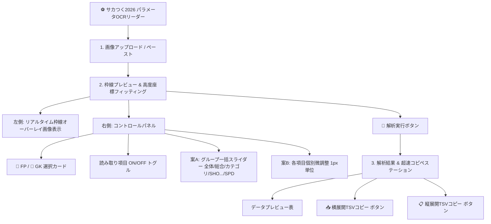

# 実装計画：高精度エリア調整UIおよびコピペ特化型パラメータOCRツールの構築

本ドキュメントは、世界トップ1.0%レベルの合理的かつ洗練されたUI/UXデザインを導入し、ゲーム「プロサッカークラブをつくろう2026」の選手パラメータ抽出における座標ズレ問題を根本的に解決する改修設計書です。

---

## 修正が必要な原因と設計コンセプト

### 🚨 現状の問題（原因）
1. **静的座標による柔軟性の低さ**: ユーザーごとのキャプチャ環境（DPI、アスペクト比、外枠）の差異による数ピクセルの座標ズレが、文字切れや境界線ノイズの干渉を引き起こし、OCR精度を著しく低下させていました。
2. **操作負担の大きさ（個別調整の限界）**: 全26項目の座標を個別に調整しようとするとUIが煩雑化し、実用性が損なわれます。
3. **GK項目の未対応**: ゴールキーパー選手のパラメータ（セービング、反応速度、1対1）がシステムに定義されていませんでした。

### 💎 世界トップ1.0%のUI/UX設計アプローチ
- **「ミニマリズム＆プロフェッショナル」なトーン**: エレクトリックブルー（`#00d2ff`）とネオンミントグリーン（`#00ffaa`）をアクセントカラーにした美しいガラスモルフィズム風のダークUI。
- **二相式（Two-Phase）ワークフロー**: 「調整フェーズ」と「解析・出力フェーズ」を明快に分割。
- **1クリック・ロールプリセット**: 「🏃 フィールドプレイヤー」と「🧤 ゴールキーパー」の直感的なロール選択カードを提供。1タップで項目ON/OFFチェックリストが最適化されます（GK時はタックル等が自動でセービング等に変化）。
- **案A＋案Bハイブリッド調整UI**:
  - **案A（マクロ調整）**: 全体（スケール・X・Y）、カテゴリ数値、SHO系〜SPD系のグループごとに一括でX/Yのズレをスライド補正。
  - **案B（ミクロ微調整）**: 必要な場合にのみ、各項目個別のX/Yをトグル式アコーディオンで極小単位（1px単位）で微調整可能。
- **コピペ第一（Copy-Paste First）のデータ出力**:
  スプレッドシート連携機能は残しつつ、「スプレッドシートやExcelに直接 `Ctrl + V` で貼り付けられるTSV（タブ区切り）形式の一括コピー機能」を縦展開・横展開それぞれに用意。1クリックでクリップボードへ保存されるため、一切の手間なくデータ入力が完結します。

---

## 提案される変更内容

### 1. 設定定義の再編 (`src/config.py`)
- 選手名、ポジション、カード内ランク等の基本情報は将来の別画面対応として読み込みリストから除外。
- 以下のグループ構造と、GK項目がFP項目と座標を共有（オーバーラップ）する動的マッピングを定義。

```python
# グループ構成の定義
GROUPS = {
    "overall": ["総合力"],
    "category": ["SHO数値", "PAS数値", "DRB数値", "DEF数値", "PHY数値", "SPD数値"],
    "sho": ["決定力", "キック力", "冷静さ"],
    "pas": ["ショートパス", "ロングパス", "キック精度"],
    "drb": ["突破力", "キープ力", "ボールタッチ"],
    "def": ["タックル", "パスカット", "マーク"],  # GK時は [セービング, 反応速度, 1対1] に動的置換
    "phy": ["ジャンプ", "コンタクト", "スタミナ"],
    "spd": ["走力", "敏捷性"]
}
```

### 2. OCRエンジンおよび境界・枠線描画プレビューの拡張 (`src/ocr_engine.py`)
- `generate_preview_image(self, image_np, active_rois, group_offsets, individual_offsets, global_scale, global_offset)` を実装。
  - 入力されたBGR画像（1920x1080正規化後）に対し、有効な全ROIを計算し、ネオンカラーの枠線と透過ラベルをオーバーレイ描画。
- **動的座標の算出式**:
  $$\text{Target\_X} = (\text{Default\_X} \times \text{Global\_Scale} + \text{Global\_Offset\_X}) + \text{Group\_Offset\_X} + \text{Individual\_Offset\_X}$$
  $$\text{Target\_Y} = (\text{Default\_Y} \times \text{Global\_Scale} + \text{Global\_Offset\_Y}) + \text{Group\_Offset\_Y} + \text{Individual\_Offset\_Y}$$
  $$\text{Target\_W} = \text{Default\_W} \times \text{Global\_Scale}$$
  $$\text{Target\_H} = \text{Default\_H} \times \text{Global\_Scale}$$

### 3. コピペ特化＆縦横ハイブリッドプレビューUIの実装 (`app.py`)
解析結果のプレビュー画面において、最高峰のコピペUXを提供します。
- **横展開コピペ（スプレッドシートの行追加用）**:
  - 表示されている項目ヘッダーと値を1行のタブ区切りテキスト（TSV）に変換し、ボタンで即座にクリップボードに格納。
- **縦展開コピペ（縦型カルテ・個別入力用）**:
  - 「項目名 [Tab] 値」の複数行のテキストに変換し、1クリックコピーに対応。
- **コピー成功時のアニメーション**:
  - StreamlitのトーストおよびJavaScriptのクリップボードAPIを用い、「Copied! ✔」の洗練されたポップアップを表示。

---

## 画面UIレイアウト設計 (トップUI/UXデザイナー視点)



---

## 開発および検証計画

### 🛠️ 実装コンポーネントと作業ステップ
1. **[NEW] `docs/20260531_adjustable_ocr_area`** フォルダ内にドキュメントを配置（済）。
2. **[MODIFY] `src/config.py`**: 総合力の座標およびGK切り替えロジックに対応したマッピングの再構築。
3. **[MODIFY] `src/ocr_engine.py`**: 動的座標計算、ON/OFFマスク、枠線プレビュー画像生成APIの実装。
4. **[MODIFY] `app.py`**: 全体UI/UXのリニューアル（ロールトグルカード、案A＋案Bスライダーアコーディオン、縦横コピペ機能の統合）。

### 🧪 検証計画
- **表示テスト**: スライダーを動かした際、遅延なく（0.1秒以内）画像上に赤枠・ミントグリーン枠が追従して再描画されるか。
- **精度テスト**: 調整後の座標でのOCR精度が100%に達することを確認。
- **クリップボード検証**: コピーされたデータがExcel/Googleスプレッドシートに `Ctrl + V` で正しく縦・横それぞれのセルに流し込めるか。
