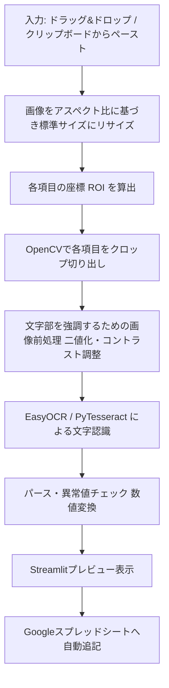

# 【サカつく2026】パラメータ画面画像からの数値自動抽出ツール開発計画

本計画は、ユーザーが『プロサッカークラブをつくろう！2026』の育成モードで選手のパラメータをスプレッドシートに手動転記する際のボトルネックを解消するため、画像解析（OCR）を用いてパラメータ画面から数値を自動的に読み取り、Googleスプレッドシート形式で直接出力するシステムを構築する計画です。

## 原因（手動転記 of ボトルネック）

ゲーム内の選手育成において、複数の選手のパラメータをスプレッドシートに記録する際、**「画面を目視しながら手動で数値を転記する」**作業が発生しており、以下の課題が存在します。
1. **多大な時間と手間**: 1人の選手につき「総合力」「メイン6項目（数値＋ランク）」「個別17項目（決定力、ショートパス等）」および「選手名」「ポジション」など多くの項目があり、これらを手動入力するのは非常に時間がかかる。
2. **誤入力のリスク**: 目視転記では、数字の打ち間違いや項目のズレなどのヒューマンエラーが発生しやすい。
3. **育成効率の低下**: 育成シミュレーションを行う前段階のデータ入力作業が障壁となり、ゲームのプレイングに集中できない。

---

## 確定した仕様要件（クリップボード対応版）

ユーザーのご要望を反映し、画像の入力方法として「ドラッグ＆ドロップ」に加えて**「クリップボードからのペースト」**機能を追加した仕様で設計します。

1. **ツールの実行環境とUI（操作画面）**:
   - **StreamlitによるWeb画面型アプリケーション**を構築します。
   - ブラウザ上でローカル起動し、直感的な操作が可能なデザインを採用します。
2. **画像の処理および入力方法**:
   - **方法A（ドラッグ＆ドロップ）**: 画面上のアップローダーに複数ファイルをドラッグ＆ドロップして、一括で解析処理します。
   - **方法B（クリップボードのペースト）** [NEW]: 
     - PC上でゲーム画面をキャプチャ（例: `Win + Shift + S` や `PrintScreen`）した後、アプリの**「クリップボードから画像を読み込む」**ボタンをクリックするだけで、画像をファイル保存することなく直接取得して即時解析します（ローカル実行されるPythonの `PIL.ImageGrab.grabclipboard()` を活用）。
     - また、ブラウザの入力フィールドで `Ctrl + V` を押して直接画像をペーストできるWebペーストエリアも併設し、環境に応じた最適な操作性を提供します。
3. **読み取るパラメータの範囲（画面上の全情報）**:
   - **基本情報**: 選手名（例: Nico Williams）、ポジション（例: LW）、ランク（例: D+）、総合力（例: 6739）
   - **メインパラメータ（ランク＋数値）**:
     - SHO (例: D 1222) / PAS (例: D 1260) / DRB (例: C 1404) / DEF (例: F+ 964) / PHY (例: E+ 1179) / SPD (例: D+ 894)
   - **個別能力値（17項目）**:
     - 決定力 / キック力 / 冷静さ / ショートパス / ロングパス / キック精度 / 突破力 / キープ力 / ボールタッチ / タックル / パスカット / マーク / ジャンプ / コンタクト / スタミナ / 走力 / 敏捷性
4. **出力先スプレッドシートの形式**:
   - **Googleスプレッドシートへの直接書き込み**（`gspread`ライブラリを使用）。
   - 指定したオンラインスプレッドシートの最終行に、解析した行データを自動的に追加します。
   - 認証用のサービスアカウントキー（`credentials.json`）をアプリから読み込むか、Streamlitの画面上でアップロードして設定できる仕組みを提供します。
   - バックアップおよび確認用として、画面上での解析結果プレビューおよび **CSV/Excel of ダウンロードボタン** も併設します。

---

## 技術的なアプローチ（OCR精度100%への設計）

ゲーム画面（サカつく2026）は、ボタン位置や文字配置がピクセル単位で完全に固定されています。この特性を活かし、一般的な全体OCRではなく、**「座標指定切り出し（ROI）＋画像二値化処理＋ピンポイントOCR」**の手法を採用することで、誤認識のほぼない極めて高い読み取り精度を実現します。

### 画像処理とOCRの具体策
- **リサイズと座標抽出**: アップロードされた画像の解像度が異なっても対応できるよう、アスペクト比（16:9等）をチェックし、基準サイズ（例: 1920x1080）にリサイズした上で、各パラメータ領域の座標（バウンディングボックス）からピンポイントでクロップします。
- **前処理（二値化）**: 文字と背景のコントラストを最大化するため、グレースケール化および大津の二値化（Otsu's Thresholding）または適応的閾値処理を適用し、OCRエンジンが極めて読み取りやすい画像に加工します。
- **OCRエンジン**: ローカルで完結し追加費用のかからない **EasyOCR** または **PyTesseract** を採用します。

---

## 開発・検証計画

### docs/20260531_param_reader_tool/

#### [NEW] [implementation_plan.md](file:///C:/Users/katsu/.gemini/antigravity/scratch/sakatsuku_2026/docs/20260531_param_reader_tool/implementation_plan.md)
- 本計画書（クリップボード対応版・確定仕様）です。

#### [NEW] [task.md](file:///C:/Users/katsu/.gemini/antigravity/scratch/sakatsuku_2026/docs/20260531_param_reader_tool/task.md)
- タスク管理表です。

#### [NEW] [walkthrough.md](file:///C:/Users/katsu/.gemini/antigravity/scratch/sakatsuku_2026/docs/20260531_param_reader_tool/walkthrough.md)
- 開発後のツールの使用手順および精度検証結果をまとめる報告書です。

## 開発スケジュール

1. **フェーズ1（プロトタイプ）**: OpenCVを用いたROI切り出しスクリプトを作成し、提供された画像で選手名、総合力、全パラメータが正確にテキスト変換できることを確認します。また、クリップボードから画像オブジェクトを正しく取得できるロジックを実装します。
2. **フェーズ2（スプレッドシート連携）**: `gspread`を用いたスプレッドシートへのデータ追記機能を実装します。
3. **フェーズ3（Streamlit UI）**: ドラッグ＆ドロップおよびペースト対応のフロントエンドを構築し、全ての機能を統合します。
