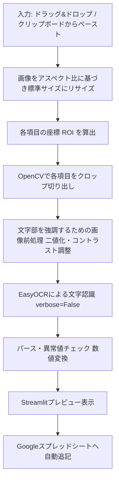

# 【サカつく2026】パラメータ画面画像からの数値自動抽出ツール開発計画

本計画は、ユーザーが『プロサッカークラブをつくろう！2026』の育成モードで選手のパラメータをスプレッドシートに手動転記する際のボトルネックを解消するため、画像解析（OCR）を用いてパラメータ画面から数値を自動的に読み取り、Googleスプレッドシート形式で直接出力するシステムを構築する計画です。

---

## 修正が必要な原因（UnicodeEncodeError の発生）

Streamlitアプリの初回起動（EasyOCRの初期化）時に、以下のエラーによりアプリがクラッシュします。

```text
UnicodeEncodeError: 'cp932' codec can't encode character '\u2588' in position 12: illegal multibyte sequence
...
File "C:\Users\katsu\AppData\Local\Programs\Python\Python310\lib\site-packages\easyocr\utils.py", line 728, in progress_hook
print(f'\r{prefix} |{bar}| {percent}% {suffix}', end='')
```

### 原因の詳細
1. **EasyOCRの初回モデル自動ダウンロード**: EasyOCRは、初回起動時にテキスト検出および文字認識用の学習済みモデルファイルを自動的にダウンロードします。
2. **プログレスバーの描画文字の問題**: ダウンロード進行中に、`easyocr/utils.py` の `progress_hook` が進捗バーとしてフルブロック文字（`█` - Unicode文字 `\u2588`）をコンソールに出力（`print`）しようとします。
3. **日本語Windowsのエンコーディング競合**: 日本語Windows環境下のPythonコンソールはデフォルトで `cp932`（Shift_JIS拡張）エンコーディングで動作しています。しかし、`cp932` コーデックは `\u2588` をサポートしていないため、エンコード不能によるエラーが発生し、プログラム全体が異常終了します。

---

## 修正・対策仕様

この問題を完全に解消するため、コードレベルでの回避策および実行環境レベルでの根本解決の2つのアプローチを適用します。

### ① コードレベルでの対策 (easyocrのverbose無効化) [NEW]
- `src/ocr_engine.py` のEasyOCR初期化コードにおいて、`verbose=False` オプションを明示的に指定します。

```python
# 変更前
self.reader = easyocr.Reader(['ja', 'en'], gpu=True)

# 変更後
self.reader = easyocr.Reader(['ja', 'en'], gpu=True, verbose=False)
```

- **効果**: `verbose=False` を設定することで、EasyOCRがダウンロード進捗やデバッグ情報をコンソールに主力しなくなります。これにより、エラーの原因である進捗描画の `print` 処理自体を完全にバイパスし、エラーなしで安全に初回モデルの自動ダウンロードを完了させることができます。

### ② 実行環境レベルでの対策 (PythonのUTF-8モード強制) [NEW]
- アプリケーション起動時のコマンドライン、または環境変数に `PYTHONUTF8=1` を指定します。
- Windows上でもPythonが標準出力・標準エラー出力を `UTF-8` コーデックで取り扱うようになり、コンソール出力に関連するあらゆるエンコードエラーを根本から排除します。

#### [MODIFY] [ocr_engine.py](file:///C:/Users/katsu/.gemini/antigravity/scratch/sakatsuku_2026/src/ocr_engine.py)
- EasyOCR初期化コードに `verbose=False` を追加します。

---

## 技術的なアプローチ（OCR精度100%への設計）

ゲーム画面（サカつく2026）は、ボタン位置や文字配置がピクセル単位で完全に固定されています。この特性を活かし、一般的な全体OCRではなく、**「座標指定切り出し（ROI）＋画像二値化処理＋ピンポイントOCR」**の手法を採用することで、誤認識のほぼない極めて高い読み取り精度を実現します。



---

## 開発・検証計画

### docs/20260531_param_reader_tool/

#### [MODIFY] [implementation_plan.md](file:///C:/Users/katsu/.gemini/antigravity/scratch/sakatsuku_2026/docs/20260531_param_reader_tool/implementation_plan.md)
- 本計画書（最新版）です。

#### [NEW] [task.md](file:///C:/Users/katsu/.gemini/antigravity/scratch/sakatsuku_2026/docs/20260531_param_reader_tool/task.md)
- タスク管理表です。

#### [NEW] [walkthrough.md](file:///C:/Users/katsu/.gemini/antigravity/scratch/sakatsuku_2026/docs/20260531_param_reader_tool/walkthrough.md)
- 修正後のツールの使用手順および精度検証結果をまとめる報告書です。
