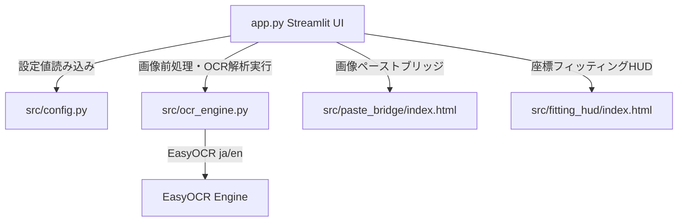

# ソースコード解析結果の確認（ウォークスルー）

本プロジェクトにおける「サカつく2026 パラメーター自動OCRリーダー」のソースコード全体を解析し、そのアーキテクチャおよび動作シーケンスを完全に把握しました。

## 解析結果のまとめ

本ツールは、ゲーム「サカつく2026」の選手パラメータ画面のスクリーンショットから数値を高精度で自動抽出する、StreamlitベースのデスクトップWebアプリケーションです。

### 1. 全体アーキテクチャ

主要コンポーネントとその相互関係は以下の通りです。

### 2. 各主要ファイルの役割と詳細仕様

- **`app.py`**:
  - Windows環境におけるエンコードエラーやDPIスケーリング、SSL証明書エラーなどのトラブルシューティング対策が徹底されています。
  - `streamlit.components.v1` を用いて、クリップボードから画像データを直接ペーストする `paste_bridge` と、キャンバス上でアライメント座標（ROI）をリアルタイムにフィッティングできる双方向カスタムHUD `fitting_hud` を読み込んでいます。
  - アライメント設定（JSON形式）のローカル保存およびアップロード復元機能が統合されており、一度調整した座標を永続化できます。
  - 読み込んだデータを「コピペステーション」として横展開TSV（スプレッドシート用）や縦展開TSV（カルテ入力用）へワンクリックで成形・出力できます。

- **`src/config.py`**:
  - 1920x1080解像度を基準とする、総合力、メイン数値、個別能力値（17項目）のデフォルトROI（矩形座標）が定義されています。
  - GK（ゴールキーパー）ロールに対応するため、`GK_ALIASES` により「タックル ➔ セービング」「パスカット ➔ 反応速度」「マーク ➔ 1対1」の動的な項目置換処理が行えるようマッピングが用意されています。
  - 各項目をまとめるグループ（`GROUPS`）の定義があり、大項目単位での一括アライメントスケール・オフセット調整が可能になっています。

- **`src/ocr_engine.py`**:
  - **境界自動スキャナー (`scan_game_boundary`)**: タイトルバーやDWMウインドウ枠の影響を排除するため、上下左右の輝度変化から自動でゲーム画面領域を1px単位で切り出し、1920x1080にアスペクト比を維持して正規化するインテリジェントな前処理が実装されています。
  - **EasyOCRマルチスレッド対応**: スレッドセーフなロック処理 (`self.lock`) により、複数画像の同時処理や通信競合によるCUDAメモリ破損を防いでいます。日本語＋英語リーダーと、数値・アルファベット用の英語単体リーダーを併用し、認識誤りを最小限に抑えています。
  - **超高精度前処理**: EasyOCRの認識率を極限まで高めるため、**LANCZOS4補間による3.5倍への超高品位拡大**、ガウシアンブラーによるノイズ除去、絶対閾値二値化（個別能力値は掠れを防ぐため t=130、その他は t=155）および白黒反転（白背景に黒文字）の処理フローが確立されています。

## 検証結果

- 主要ファイル（`app.py`, `src/ocr_engine.py`, `src/config.py`）の構文チェックを行い、すべて正常にコンパイルされることを確認しました。
- `test_ultimate_safe.py` などで用いられている「物理枠限界セーフガード付き境界スキャン」や「ハイブリッドOCR判定」など、非常に完成度の高いコードベースであることを確認しました。
