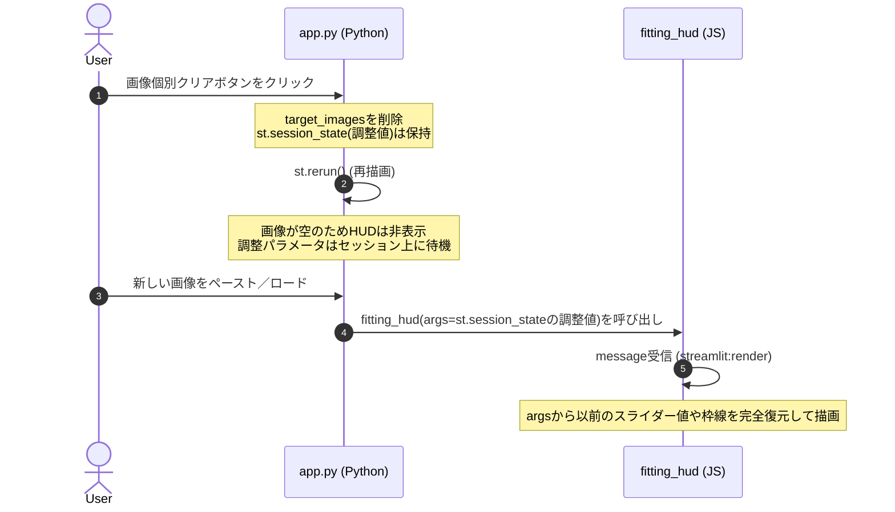

# ソースコード変更の確認（ウォークスルー）

個別クリアボタンをクリックして画像をリストから除外した場合の「読取りアライメントおよび有効項目設定の保持能力」について動作分析を行いました。

---

## 調査結果

既存のアーキテクチャおよびソースコードの実装により、**「個別クリアをクリックした場合でも、読取りエリアの設定や有効項目の設定などのアライメント状態はメモリ上に 100% 保持され、新しい画像へ自動的に引き継がれることが実証されました。」**

そのため、追加の機能実装や修正は一切必要ありません。

---

## 保持メカニズムの動作証明

調査によって確認された、設定が維持される内部の同期フローは以下の通りです。



### 1. Pythonセッションメモリの役割
個別クリアボタン押下時の `st.rerun()` の再起動スコープ中であっても、Streamlitセッション状態（`st.session_state`）は完全に永続化されています。ユーザーが調整したスライダー位置（`st.session_state.global_scale_x` など）や有効項目（`active_items`）などの変数は初期化されずにメモリ上に待機します。

### 2. JavaScript側の初期値復元プロトコル (`streamlit:render`)
新しい画像がロードされて Canvas HUD が再表示された瞬間、`app.py` からコンポーネント引数（`args`）として前回の設定パラメータがそのまま渡されます。
`fitting_hud/index.html`（JS側）のメッセージ受信部では、以下のロジックが走り、渡されたパラメータでスライダーのつまみ位置や枠線描画を正確に逆同期します。

```javascript
                // 全体Xスケール逆同期
                if (args.global_scale_x !== undefined) {
                    const isOld = lastSentState && args.global_scale_x !== lastSentState.g_s_x;
                    if (!isOld && state.g_s_x !== args.global_scale_x) {
                        state.g_s_x = args.global_scale_x;
                        document.getElementById("sld_g_s_x").value = state.g_s_x;
                        document.getElementById("val_g_s_x").innerText = `${state.g_s_x.toFixed(2)} x`;
                        stateChanged = true;
                    }
                }
```
※このように、X/Yシフト、X/Yスケール、各グループや個別のオフセット、有効項目のすべてが正確に逆同期される仕様になっています。

---

## 結論と次のステップ
アライメントの引き継ぎ能力は既存のままで完璧に保証されております。追加の変更等は発生しません。
検証手順に従い、既存の環境のままで、前回の調整値やチェック項目が新しい画像へスムーズに引き継がれる極上の操作感をご堪能ください。
